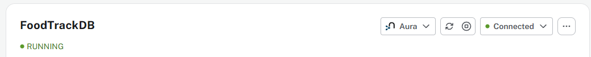
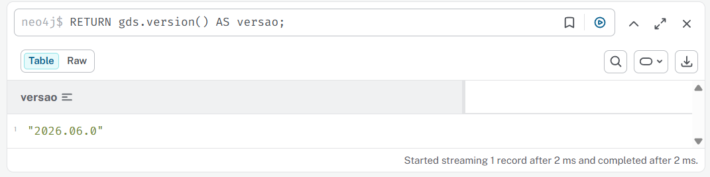
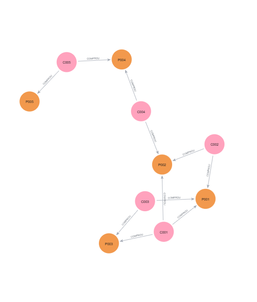
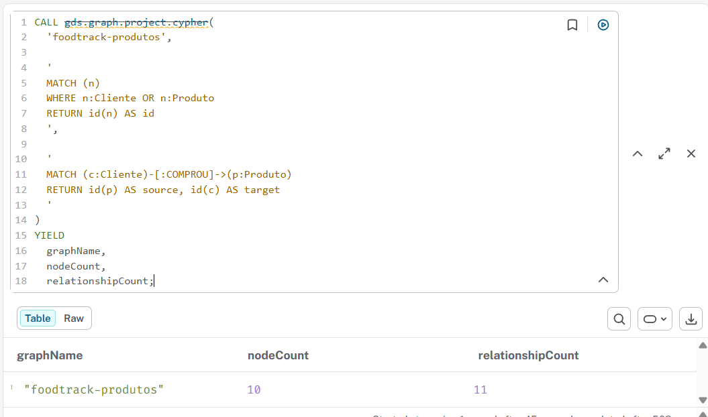
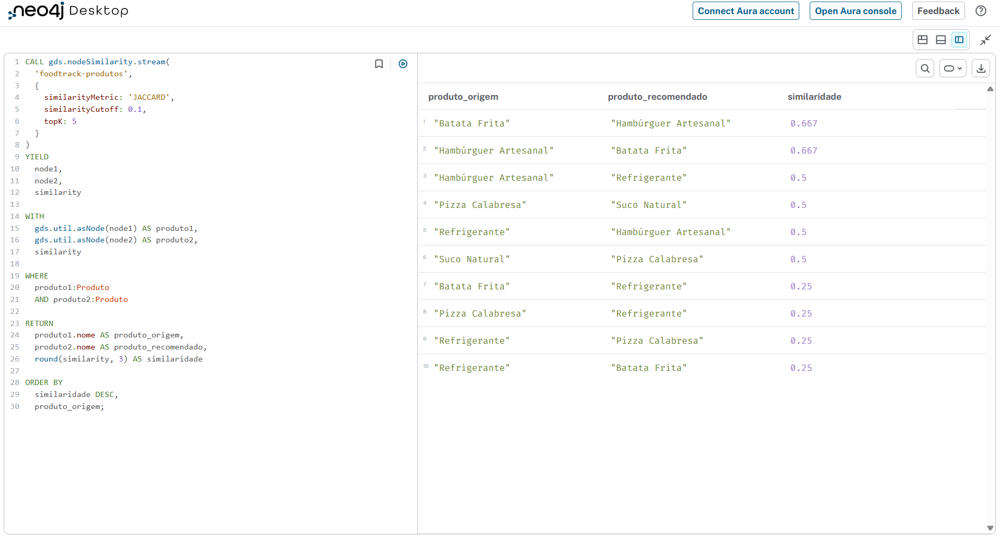
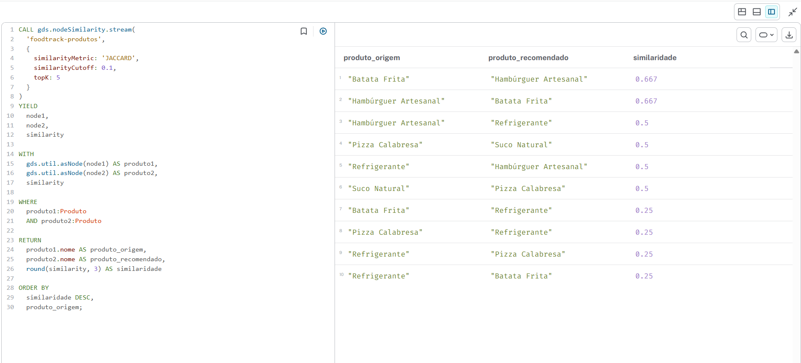
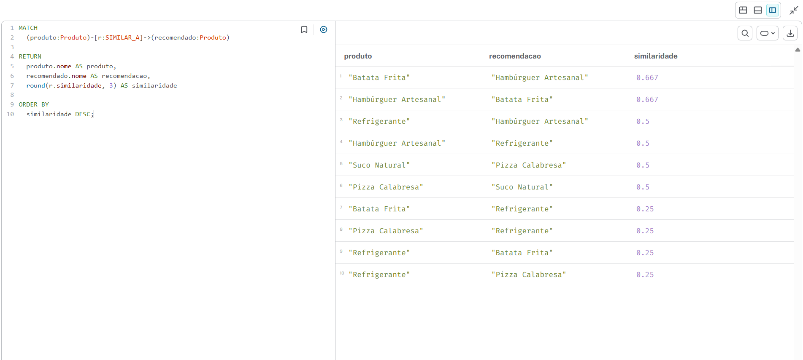
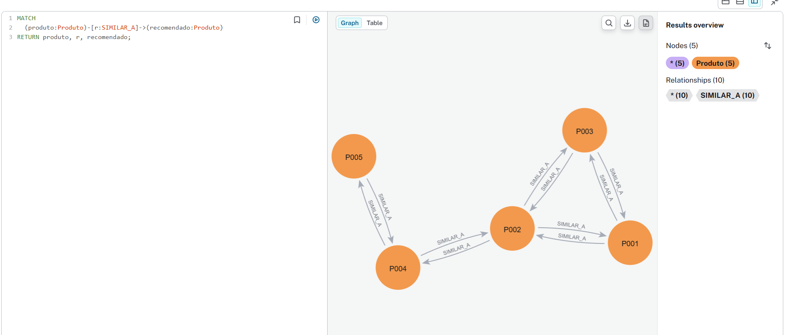

# Etapa 6 — Grafo e Graph Data Science

## 1. Objetivo da etapa

Nesta etapa foi criado um grafo para representar as relações entre clientes e produtos do sistema FoodTrack.

A funcionalidade escolhida foi a recomendação de produtos com base no comportamento de compra dos clientes. A proposta é identificar produtos que são comprados pelos mesmos clientes e, a partir dessa informação, gerar sugestões de produtos relacionados.

Um exemplo de aplicação é:

> Clientes que compraram Hambúrguer Artesanal também costumam comprar Batata Frita ou Refrigerante.

Para realizar essa análise, foi utilizado o Neo4j e o plugin Graph Data Science, conhecido como GDS.

---

## 2. Ferramentas utilizadas

Foram utilizadas as seguintes ferramentas:

- Neo4j Desktop;
- banco de grafos Neo4j;
- linguagem de consulta Cypher;
- biblioteca Graph Data Science;
- algoritmo Node Similarity;
- métrica de similaridade de Jaccard.

Foi criada uma instância local denominada:

```text
FoodTrackDB
```

A instância armazena os nós e os relacionamentos usados na análise.

### Evidência da instância



---

## 3. Verificação do Graph Data Science

Depois da instalação do plugin Graph Data Science, foi executada a seguinte consulta:

```cypher
RETURN gds.version() AS versao;
```

Essa consulta chama a função `gds.version()` e retorna a versão instalada da biblioteca.

A apresentação de uma versão confirma que o plugin foi carregado corretamente pela instância do Neo4j.

### Evidência



---

## 4. Modelo do grafo

O grafo do FoodTrack possui dois tipos principais de nós:

```text
(:Cliente)
(:Produto)
```

Os clientes são conectados aos produtos por meio do relacionamento:

```text
(:Cliente)-[:COMPROU]->(:Produto)
```

O modelo pode ser representado da seguinte forma:

```text
Cliente ── COMPROU ──> Produto
```

Cada cliente pode estar conectado a vários produtos, e cada produto pode ter sido comprado por vários clientes.

Essa estrutura permite analisar as relações de compra diretamente, sem depender apenas de documentos ou tabelas.

---

## 5. Criação dos nós de clientes

Os clientes foram criados com a seguinte consulta:

```cypher
CREATE
  (:Cliente {
    id: "C001",
    nome: "João Silva"
  }),
  (:Cliente {
    id: "C002",
    nome: "Maria Oliveira"
  }),
  (:Cliente {
    id: "C003",
    nome: "Carlos Souza"
  }),
  (:Cliente {
    id: "C004",
    nome: "Ana Pereira"
  }),
  (:Cliente {
    id: "C005",
    nome: "Pedro Santos"
  });
```

O comando `CREATE` adiciona novos elementos ao banco.

Cada trecho como:

```cypher
(:Cliente {
  id: "C001",
  nome: "João Silva"
})
```

cria um nó com o rótulo `Cliente`.

O rótulo indica o tipo do nó, enquanto `id` e `nome` são propriedades armazenadas nele.

---

## 6. Criação dos nós de produtos

Os produtos foram criados com:

```cypher
CREATE
  (:Produto {
    id: "P001",
    nome: "Hambúrguer Artesanal",
    tipo: "Lanche"
  }),
  (:Produto {
    id: "P002",
    nome: "Refrigerante",
    tipo: "Bebida"
  }),
  (:Produto {
    id: "P003",
    nome: "Batata Frita",
    tipo: "Porção"
  }),
  (:Produto {
    id: "P004",
    nome: "Pizza Calabresa",
    tipo: "Pizza"
  }),
  (:Produto {
    id: "P005",
    nome: "Suco Natural",
    tipo: "Bebida"
  });
```

Cada produto possui:

- um identificador;
- um nome;
- um tipo.

---

## 7. Criação dos relacionamentos de compra

Depois da criação dos nós, foram criados os relacionamentos entre clientes e produtos:

```cypher
MATCH
  (joao:Cliente {id: "C001"}),
  (maria:Cliente {id: "C002"}),
  (carlos:Cliente {id: "C003"}),
  (ana:Cliente {id: "C004"}),
  (pedro:Cliente {id: "C005"}),

  (hamburguer:Produto {id: "P001"}),
  (refrigerante:Produto {id: "P002"}),
  (batata:Produto {id: "P003"}),
  (pizza:Produto {id: "P004"}),
  (suco:Produto {id: "P005"})

CREATE
  (joao)-[:COMPROU {quantidade: 2}]->(hamburguer),
  (joao)-[:COMPROU {quantidade: 1}]->(refrigerante),
  (joao)-[:COMPROU {quantidade: 1}]->(batata),

  (maria)-[:COMPROU {quantidade: 1}]->(hamburguer),
  (maria)-[:COMPROU {quantidade: 2}]->(refrigerante),

  (carlos)-[:COMPROU {quantidade: 1}]->(hamburguer),
  (carlos)-[:COMPROU {quantidade: 1}]->(batata),

  (ana)-[:COMPROU {quantidade: 1}]->(pizza),
  (ana)-[:COMPROU {quantidade: 1}]->(refrigerante),

  (pedro)-[:COMPROU {quantidade: 1}]->(pizza),
  (pedro)-[:COMPROU {quantidade: 1}]->(suco);
```

O `MATCH` localiza os nós que já foram criados.

O trecho:

```cypher
(joao)-[:COMPROU {quantidade: 2}]->(hamburguer)
```

cria um relacionamento direcionado do cliente para o produto.

O relacionamento possui a propriedade `quantidade`, que registra quantas unidades foram compradas.

---

## 8. Visualização do grafo

Para visualizar os clientes, os produtos e os relacionamentos, foi executada a consulta:

```cypher
MATCH (c:Cliente)-[r:COMPROU]->(p:Produto)
RETURN c, r, p;
```

O `MATCH` procura o padrão:

```text
Cliente → COMPROU → Produto
```

O `RETURN` devolve os nós e os relacionamentos encontrados, permitindo exibi-los no formato de grafo.

### Evidência do grafo



A visualização demonstra que um cliente pode comprar vários produtos e que um produto pode estar conectado a diferentes clientes.

---

## 9. Funcionalidade escolhida

A funcionalidade definida para o FoodTrack foi a recomendação de produtos.

O objetivo é descobrir quais produtos possuem padrões de compra semelhantes. Dois produtos são considerados semelhantes quando são comprados por clientes em comum.

Por exemplo:

```text
Hambúrguer Artesanal:
João, Maria e Carlos

Batata Frita:
João e Carlos
```

Os produtos compartilham dois clientes, João e Carlos. Portanto, existe uma relação relevante entre eles.

Essa informação pode ser utilizada durante o cadastro de um pedido para sugerir um produto complementar.

---

## 10. Operação GDS escolhida

Foi utilizado o algoritmo:

```text
Node Similarity
```

O Node Similarity compara os vizinhos de diferentes nós.

No grafo do FoodTrack:

- os nós analisados são os produtos;
- os vizinhos dos produtos são os clientes que os compraram;
- produtos com clientes em comum recebem uma pontuação de similaridade.

A métrica escolhida foi:

```text
Jaccard
```

A similaridade de Jaccard considera a quantidade de vizinhos compartilhados em relação ao total de vizinhos distintos dos dois nós.

---

## 11. Criação da projeção em memória

Os algoritmos GDS não são executados diretamente sobre o grafo armazenado no banco. Antes da execução, é criada uma projeção em memória.

A projeção foi criada com:

```cypher
CALL gds.graph.project.cypher(
  'foodtrack-produtos',

  '
  MATCH (n)
  WHERE n:Cliente OR n:Produto
  RETURN id(n) AS id
  ',

  '
  MATCH (c:Cliente)-[:COMPROU]->(p:Produto)
  RETURN id(p) AS source, id(c) AS target
  '
)
YIELD
  graphName,
  nodeCount,
  relationshipCount;
```

O nome dado à projeção foi:

```text
foodtrack-produtos
```

A consulta de nós inclui clientes e produtos.

A consulta de relacionamentos cria, no grafo analítico, conexões orientadas de produtos para clientes:

```text
Produto → Cliente
```

Essa orientação permite que o Node Similarity compare os clientes conectados a cada produto.

### Evidência da projeção



Os campos apresentados no resultado são:

- `graphName`: nome da projeção;
- `nodeCount`: quantidade de nós carregados;
- `relationshipCount`: quantidade de relacionamentos carregados.

---

## 12. Execução do Node Similarity

O algoritmo foi executado inicialmente no modo `stream`:

```cypher
CALL gds.nodeSimilarity.stream(
  'foodtrack-produtos',
  {
    similarityMetric: 'JACCARD',
    similarityCutoff: 0.1,
    topK: 5
  }
)
YIELD
  node1,
  node2,
  similarity

WITH
  gds.util.asNode(node1) AS produto1,
  gds.util.asNode(node2) AS produto2,
  similarity

WHERE
  produto1:Produto
  AND produto2:Produto

RETURN
  produto1.nome AS produto_origem,
  produto2.nome AS produto_recomendado,
  round(similarity, 3) AS similaridade

ORDER BY
  similaridade DESC,
  produto_origem;
```

### Parâmetros utilizados

#### `similarityMetric`

```cypher
similarityMetric: 'JACCARD'
```

Define que a comparação utilizará a métrica de Jaccard.

#### `similarityCutoff`

```cypher
similarityCutoff: 0.1
```

Descarta relações com similaridade inferior a `0.1`.

#### `topK`

```cypher
topK: 5
```

Limita a quantidade de resultados mais semelhantes por nó.

#### Modo `stream`

O modo `stream` devolve os resultados como uma tabela, sem alterar permanentemente o banco.

### Evidência do código



### Evidência do resultado



---

## 13. Interpretação dos resultados

A coluna `produto_origem` apresenta o produto analisado.

A coluna `produto_recomendado` apresenta outro produto que compartilha clientes com o produto de origem.

A coluna `similaridade` apresenta a intensidade dessa relação.

Quanto mais próximo o valor estiver de `1`, maior é a proporção de clientes compartilhados.

Por exemplo, considerando:

```text
Hambúrguer:
João, Maria e Carlos

Batata:
João e Carlos
```

A interseção possui dois clientes:

```text
João e Carlos
```

A união possui três clientes distintos:

```text
João, Maria e Carlos
```

Assim, a similaridade de Jaccard é:

```text
2 ÷ 3 = 0,667
```

Esse resultado mostra que Hambúrguer Artesanal e Batata Frita possuem uma relação relevante de compra.

---

## 14. Gravação dos relacionamentos de similaridade

Depois da validação no modo `stream`, o algoritmo pode ser executado no modo `write`:

```cypher
CALL gds.nodeSimilarity.write(
  'foodtrack-produtos',
  {
    similarityMetric: 'JACCARD',
    similarityCutoff: 0.1,
    topK: 5,
    writeRelationshipType: 'SIMILAR_A',
    writeProperty: 'similaridade'
  }
)
YIELD
  nodesCompared,
  relationshipsWritten;
```

O modo `write` grava as relações encontradas no banco.

Foi definido o tipo de relacionamento:

```text
SIMILAR_A
```

E a propriedade:

```text
similaridade
```

O resultado possui a seguinte estrutura:

```text
(:Produto)-[:SIMILAR_A {
  similaridade: valor
}]->(:Produto)
```

---

## 15. Consulta das recomendações gravadas

Os relacionamentos gerados podem ser consultados com:

```cypher
MATCH
  (produto:Produto)-[r:SIMILAR_A]->(recomendado:Produto)

RETURN
  produto.nome AS produto,
  recomendado.nome AS recomendacao,
  round(r.similaridade, 3) AS similaridade

ORDER BY
  similaridade DESC;
```

Essa consulta localiza produtos conectados pelo relacionamento `SIMILAR_A`.

### Evidência





---

## 16. Aplicação no FoodTrack

No FoodTrack, essa funcionalidade pode ser utilizada durante a criação do pedido.

Quando um atendente selecionar um produto, o sistema poderá buscar os produtos similares e mostrar sugestões.

Exemplo:

```text
Produto selecionado:
Hambúrguer Artesanal

Produtos recomendados:
- Batata Frita
- Refrigerante
```

Essa recomendação pode:

- facilitar a montagem do pedido;
- ajudar o atendente;
- aumentar a venda de produtos complementares;
- tornar a experiência mais personalizada.

---

## 17. Como a etapa responde ao enunciado

A atividade solicitava:

> Criar um grafo e identificar uma operação GDS para implementar uma funcionalidade relevante para o sistema.

O requisito foi atendido por meio de:

- criação de nós `Cliente`;
- criação de nós `Produto`;
- criação de relacionamentos `COMPROU`;
- visualização do grafo;
- projeção do grafo em memória;
- execução do algoritmo GDS Node Similarity;
- utilização da métrica de Jaccard;
- criação de relacionamentos `SIMILAR_A`;
- implementação conceitual de recomendação de produtos.

A funcionalidade é relevante porque usa o histórico de compras para sugerir produtos relacionados durante a realização dos pedidos.

---

## 18. Conclusão

A utilização do Neo4j complementa as demais tecnologias usadas no FoodTrack.

O MongoDB armazena clientes, produtos e pedidos como documentos. O Redis implementa estruturas rápidas, como fila, ranking e contagem de clientes únicos. O Neo4j representa as relações entre clientes e produtos.

O Graph Data Science transforma essas relações em recomendações, permitindo encontrar produtos semelhantes com base nos clientes que os compraram.

Dessa forma, a Etapa 6 demonstra como uma modelagem em grafo pode implementar uma funcionalidade que seria mais complexa de analisar apenas com documentos tradicionais.
